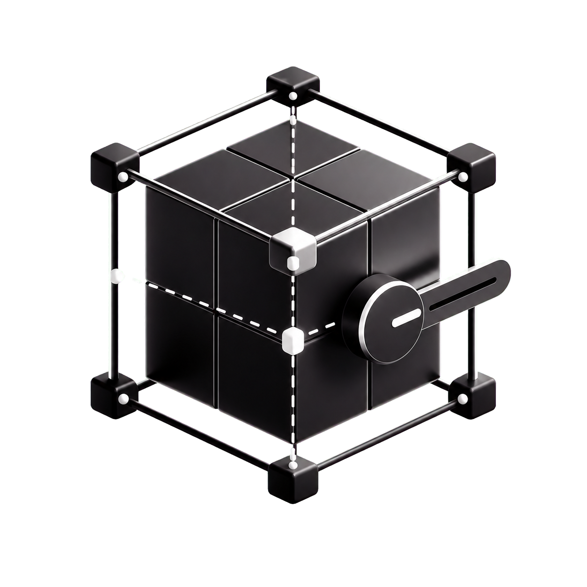

<p align="center">
  
</p>

<h1 align="center">immersive-web-editor</h1>

<h3 align="center">Visual editing for Vite apps, synced back to code.</h3>

<p align="center">
  <a href="https://www.npmjs.com/package/immersive-web-editor"></a>
  
  
</p>

Immersive Web Editor turns authored values into visual controls. It is especially useful for React Three Fiber and vanilla Three.js scenes, where camera, light, transform, material, animation, and layout values are much easier to tune visually than by editing literals.

## Example

Group related values, then spread them into the props they drive.

```tsx
import { color, config, number, position3D, rotation3D, scale3D, val } from 'immersive-web-editor';

function Hero() {
  const hero = config('Hero', {
    mesh: {
      visible: val(true),
      position: val([0, 1, 0], position3D()),
      rotation: val([0, 0, 0], rotation3D()),
      scale: val([1, 1, 1], scale3D()),
    },
    material: {
      color: val('#ff7755', color()),
      roughness: val(0.45, number(0.45, { min: 0, max: 1, step: 0.01 })),
    },
  });

  return (
    <mesh {...hero.mesh}>
      <boxGeometry />
      <meshStandardMaterial {...hero.material} />
    </mesh>
  );
}
```

Edits made in the visual editor update the matching `val(...)` literals in your source.

## Install

```ts
// vite.config.ts
import { defineConfig } from 'vite';
import editorPlugin from 'immersive-web-editor';

export default defineConfig({
  plugins: [editorPlugin()],
});
```

Run Vite and open `/editor`.

## What to expose

Expose as much authored state as is reasonable: camera defaults, light settings, mesh transforms, material values, layout numbers, labels, toggles, spawn points, animation constants, physics constants, and postprocessing knobs.

Keep values JSON-shaped. Avoid derived values, frame-by-frame state, secrets, callbacks, loaded assets, class instances, and library objects such as `THREE.Vector3`.

## Custom schemas

Use built-in schemas like `number`, `color`, `position3D`, `rotation3D`, and `scale3D` first. Create a schema with `defineField()` when a domain-specific control is worth it.
